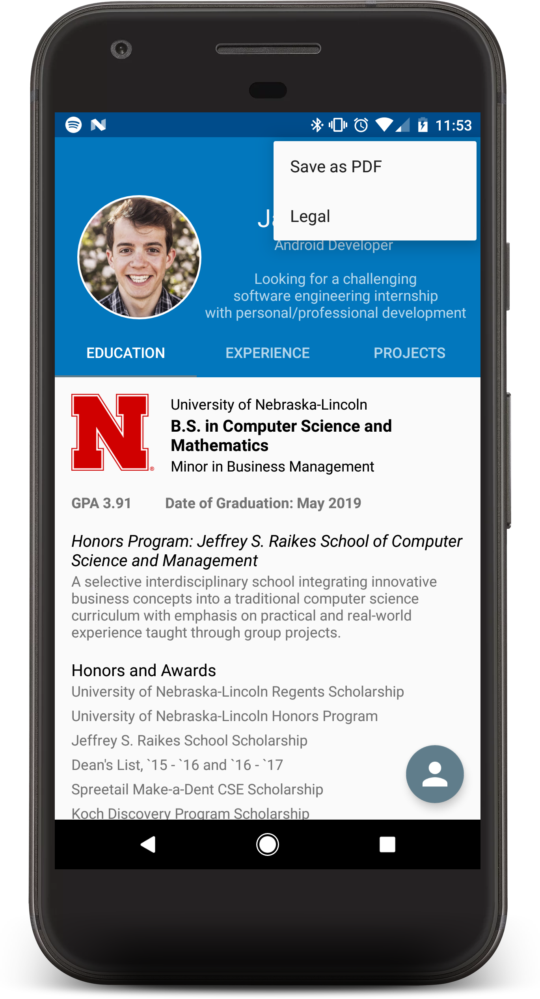
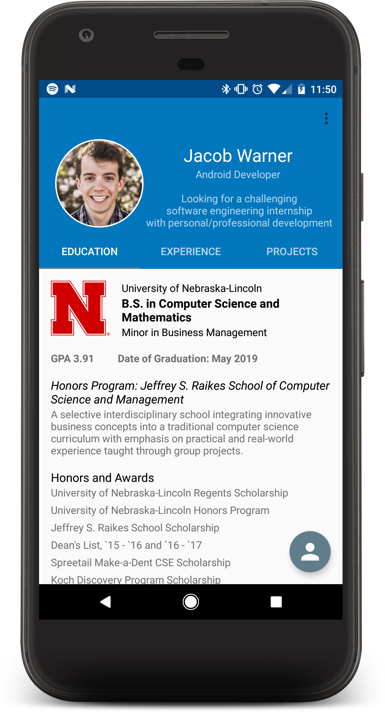
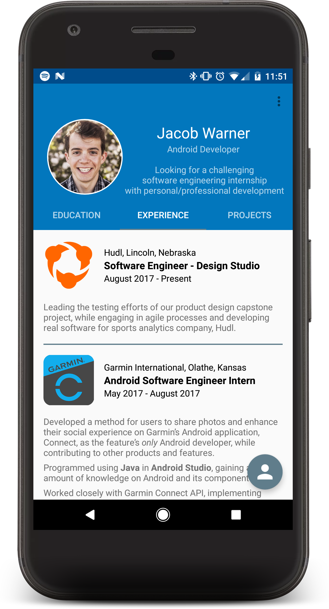
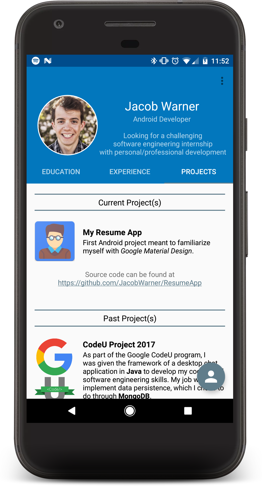
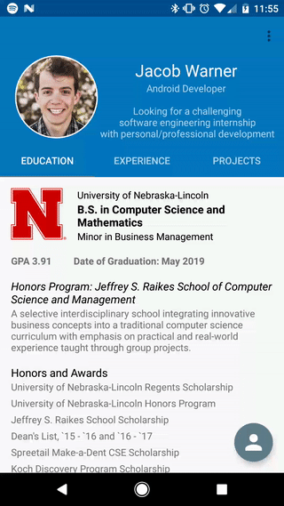

# JW's Resume

<h3>Introduction</h3>

In the summer of 2017, I became an Android Software Engineer Intern for Garmin International. While learning Android, I started thinking of side projects I could do. After thinking through a few ideas, I felt <b>JW's Resume</b> would be useful to do first.

With internship applications opening up, a resume app was a perfect side-project. I thought...
>"Not only can I show off my new Android knowledge and my resume in a visually appealing way, but I can learn Google Material Design while doing it!"

Since I was still working at Garmin, it took about ten days of working on and off to complete the project. A lot of the time was spent reading through Google Material Design documentation, but I learned a lot and I'm proud of how the application turned out.

<h2>Application Sections</h2>

The application has four main sections - the description header, education tab, experience tab, and projects tab.

<h4>Description Header</h4>

The description header contains a circular portrait, my name, and a small description of what type of internship I'm looking for currently. I placed them all within a CollapsingToolbarLayout, so that the header would hide when users scrolled vertically to see more information. When it hides, it "snaps" to the TabLayout - following Google Material Design.

  

In the top right corner, I have an options menu containing two menu items - "<i>Save as PDF</i>" and "<i>Legal</i>". If a user wants a digital PDF version of my resume, they may download it directly from the app. At first, I wanted to put the PDF directly inside the application, but then I realized any update to my resume would mean an update for my app. So, I decided to upload my file to Dropbox and, using its URL, download the file using DownloadManager. The URL does not change, so I can make changes to the file at any time. The Legal menu item gives credit to those who's code I used in my project.

  

<h4>Education Tab</h4>

One of the most important sections in a resume - <b>education</b>. It contains information on my current college education and past high school education. I wanted to show this first because a user will immediately see what I'm studying - computer science and mathematics - which ties into my description at the top and why I'm looking for software engineering internships.

  

<h4>Experience Tab</h4>

A section that may be even more important than education - <b>experience</b>. In my opinion, an individual with absolutely no education can still be seen as intelligent as long as they have the experience to support that claim. My experience section contains information on past internships and programs I've taken part in.

  

<h4>Projects Tab</h4>

I didn't have a <b>projects</b> section in my resume until recently, but I have many ideas for side projects that'll help build it up in the future. It contains slight summaries on side projects I have completed or are currently working on, along with their respective GitHub links.

  

<h2>Google Material Design</h2>

Material design has a lot of documentation online, so I'm sure I missed some aspects, but I'm still proud of the end result. I followed default margin, text, and spacing sizes, as well as layout behavior (i.e. hiding the FloatingActionButton/FloatingToolbar when a user scrolls down). I also tried to find colors that mixed well - sticking to a primary color of blue and a secondary color of gray - and used them according to material design (i.e. toolbar as primary and actions as gray). I not only learned a lot about how things should look, but also how they should act for the user and why.

  

<h2>FloatingToolbar</h2>

If users want to contact me, they can tap on the FloatingActionButton on the bottom right, causing a FloatingToolbar to morph into view. The FloatingToolbar contains phone and email icons that, when tapped, will either take the user to their keypad with my number already filled in, or start an email directed towards me. I originally had three buttons in the header for calling, emailing, and saving the PDF, but I then learned that there should usually be one FloatingActionButton per page with its action(s) being of similar functionality. So, I decided to place contact actions in the FloatingToolbar, and the saving functionality in my options menu.

  

